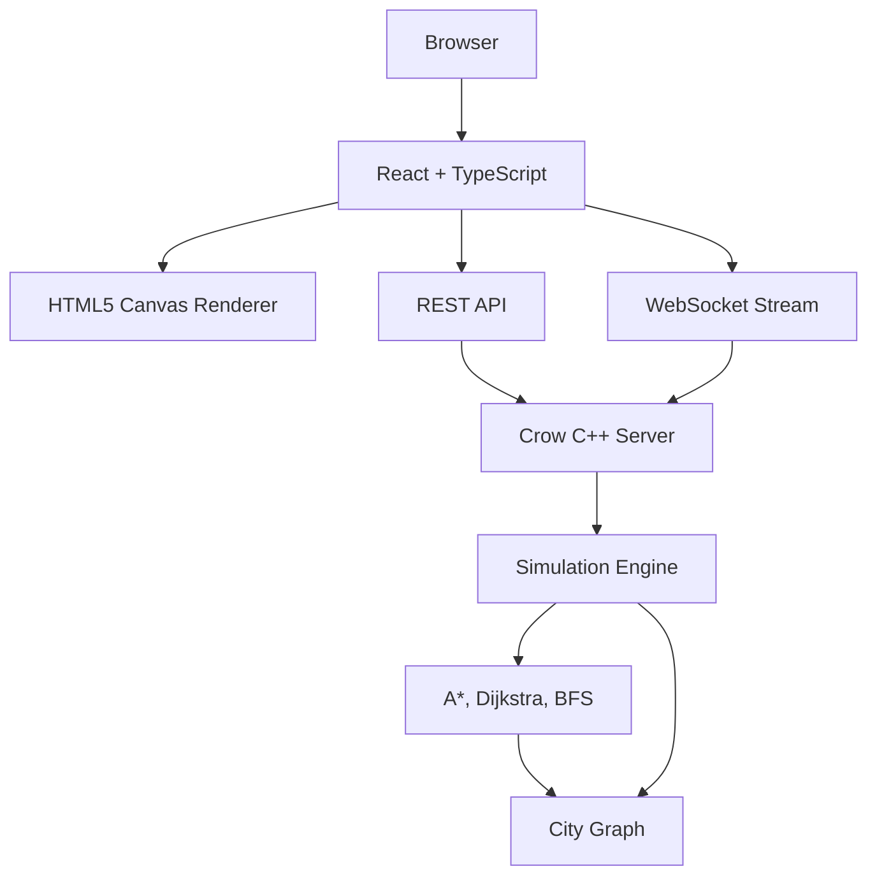
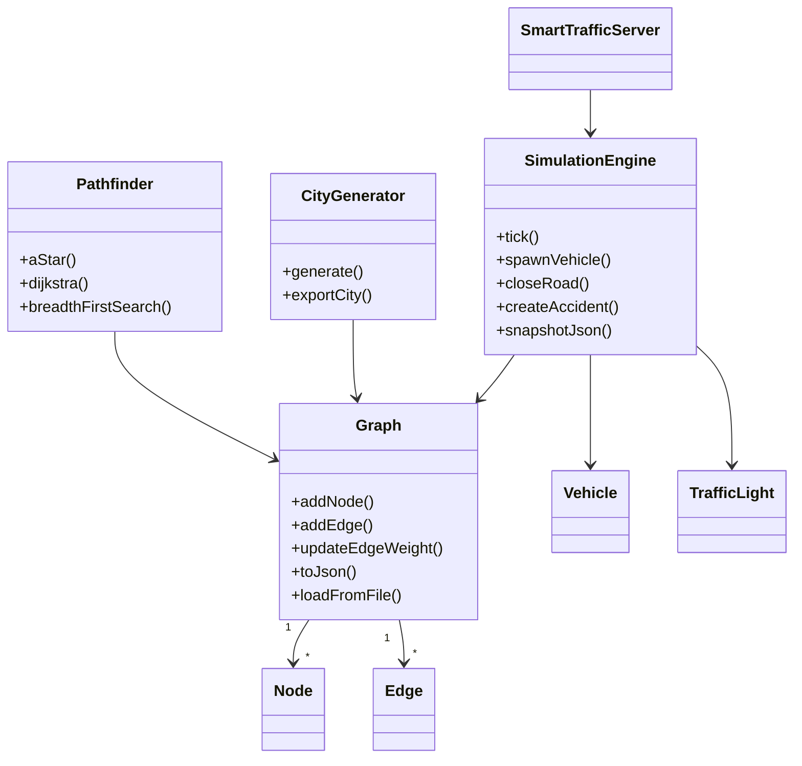
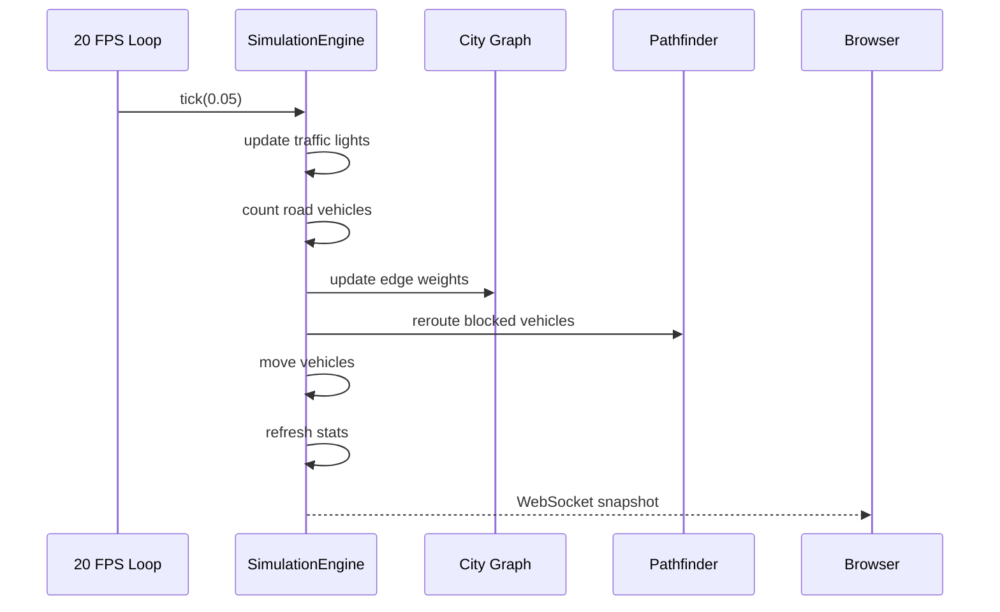

# Architecture

## System

```mermaid
flowchart TD
    Browser[Browser]
    React[React + TypeScript]
    Canvas[HTML5 Canvas Renderer]
    REST[REST API]
    WS[WebSocket Stream]
    Crow[Crow C++ Server]
    Engine[Simulation Engine]
    Pathfinding[A*, Dijkstra, BFS]
    Graph[City Graph]

    Browser --> React
    React --> Canvas
    React --> REST
    React --> WS
    REST --> Crow
    WS --> Crow
    Crow --> Engine
    Engine --> Pathfinding
    Pathfinding --> Graph
    Engine --> Graph
```

## Core Classes

```mermaid
classDiagram
    class Graph {
      +addNode()
      +addEdge()
      +updateEdgeWeight()
      +toJson()
      +loadFromFile()
    }
    class Node
    class Edge
    class Pathfinder {
      +aStar()
      +dijkstra()
      +breadthFirstSearch()
    }
    class CityGenerator {
      +generate()
      +exportCity()
    }
    class SimulationEngine {
      +tick()
      +spawnVehicle()
      +closeRoad()
      +createAccident()
      +snapshotJson()
    }
    class Vehicle
    class TrafficLight
    class SmartTrafficServer

    Graph "1" --> "*" Node
    Graph "1" --> "*" Edge
    Pathfinder --> Graph
    CityGenerator --> Graph
    SimulationEngine --> Graph
    SimulationEngine --> Vehicle
    SimulationEngine --> TrafficLight
    SmartTrafficServer --> SimulationEngine
```

## Simulation Tick

```mermaid
sequenceDiagram
    participant Timer as 20 FPS Loop
    participant Engine as SimulationEngine
    participant Graph as City Graph
    participant AStar as Pathfinder
    participant Client as Browser

    Timer->>Engine: tick(0.05)
    Engine->>Engine: update traffic lights
    Engine->>Engine: count road vehicles
    Engine->>Graph: update edge weights
    Engine->>AStar: reroute blocked vehicles
    Engine->>Engine: move vehicles
    Engine->>Engine: refresh stats
    Engine-->>Client: WebSocket snapshot
```
